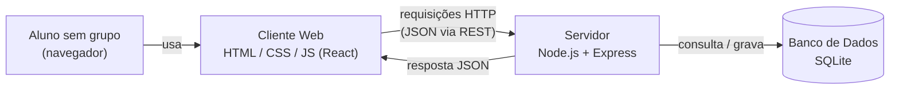
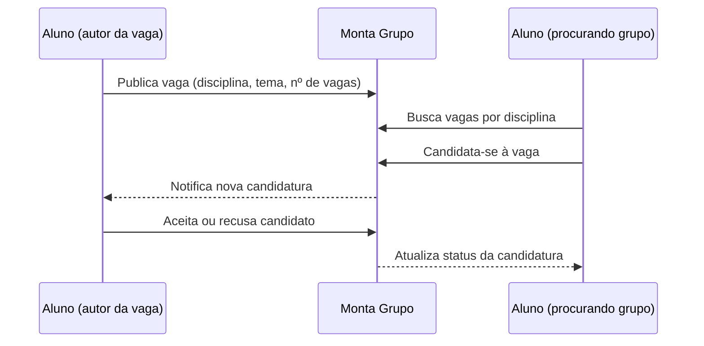

[proposta.md](https://github.com/user-attachments/files/31752012/proposta.md)
# Proposta do Projeto — Etapa 01

## Nome da aplicação

**Monta Grupo**

## Descrição do problema

Em muitas disciplinas, os professores pedem que os alunos formem grupos para trabalhos e projetos. Na prática, nem sempre isso é simples: alunos que faltaram na aula em que os grupos se formaram, que mudaram de turma/horário recentemente, que têm poucos contatos na sala, ou que simplesmente ficaram de fora quando as "panelinhas" já se fecharam acabam sem grupo até perto do prazo de entrega.

Isso gera três problemas recorrentes: atraso na formação das equipes, grupos montados às pressas e sem afinidade de disponibilidade/tema, e alunos que chegam a ficar sem grupo nenhum. O **Monta Grupo** existe para resolver esse problema específico: dar um lugar central onde quem já tem uma vaga aberta em seu grupo publica, e quem está sem grupo encontra e se candidata.

## Público-alvo

Alunos de graduação (de qualquer curso) que precisam formar grupos para trabalhos, projetos ou atividades acadêmicas em equipe.

## Objetivo principal da aplicação

Conectar alunos que têm vagas abertas em um grupo de trabalho com alunos que estão procurando um grupo, através de publicações de vagas e candidaturas, reduzindo o tempo e o atrito de formar equipes para trabalhos acadêmicos.

## Funcionalidades

1. Cadastro e login de aluno.
2. Publicar uma vaga de grupo, informando disciplina, tema do trabalho, número de vagas disponíveis, prazo de entrega e uma descrição livre.
3. Listar e buscar vagas abertas, com filtro por disciplina.
4. Candidatar-se a uma vaga publicada.
5. Aceitar ou recusar candidaturas recebidas (o autor da publicação decide quem entra).
6. Acompanhar, em um painel pessoal, as publicações que o aluno criou e as candidaturas que ele enviou, com o status de cada uma.
7. Encerrar manualmente uma vaga quando o grupo já estiver completo.

## Entidades / conceitos do domínio

- **Usuário (Aluno):** representa quem usa a aplicação — quem publica vagas e quem se candidata a elas.
- **Publicação (Vaga de Grupo):** representa uma vaga em aberto em um grupo de trabalho, criada por um usuário.
- **Candidatura:** representa o interesse de um usuário em entrar em uma publicação específica, e a decisão do autor sobre ela.

## Telas / interfaces

1. **Login / Cadastro** — autenticação do aluno na plataforma.
2. **Lista de Vagas** — mural com as publicações abertas, com busca e filtro por disciplina.
3. **Detalhe da Publicação** — mostra a descrição completa da vaga; se o aluno for o autor, mostra a lista de candidatos para aceitar/recusar; se não for, mostra o botão para se candidatar.
4. **Criar Publicação** — formulário para abrir uma nova vaga de grupo.
5. **Meu Painel** — lista as publicações criadas pelo aluno e as candidaturas que ele enviou, com o status de cada uma.

## Operações da aplicação

1. Criar uma nova publicação (vaga de grupo).
2. Listar publicações, com filtro opcional por disciplina e por status (aberta/completa/encerrada).
3. Consultar o detalhe de uma publicação específica.
4. Registrar a candidatura de um aluno a uma publicação.
5. Aceitar ou recusar uma candidatura (atualiza o status da candidatura e, se necessário, o status da publicação).
6. Encerrar uma publicação (marcar como completa/encerrada).
7. Editar ou remover uma publicação criada pelo próprio autor.

## Tecnologias pretendidas

- **Cliente:** HTML5 semântico, CSS e JavaScript, evoluindo ao longo do semestre para React, conforme o conteúdo visto em aula.
- **Servidor:** Node.js com Express, expondo uma API REST em JSON.
- **Persistência:** SQLite — banco de dados relacional simples, sem necessidade de servidor de banco separado, adequado ao tamanho do projeto.

## Diagrama — visão geral da solução

Fluxo típico de uso:

## Requisitos atendidos

Esta proposta não é uma página estática nem um CRUD trivial sem contexto: existe um problema real de organização (formação de grupos de trabalho) por trás da aplicação, com um fluxo de duas pontas (quem oferece vaga e quem procura) que justifica a existência do sistema.
